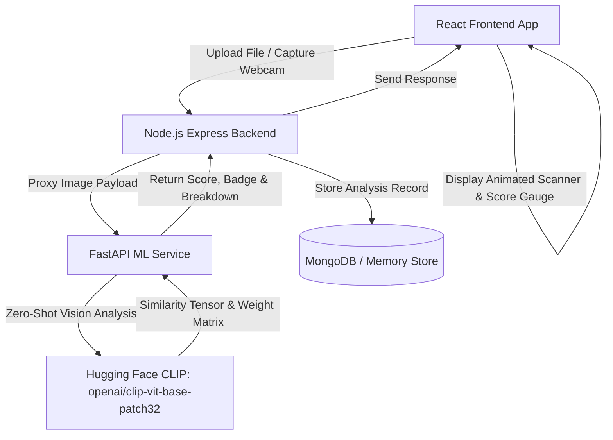
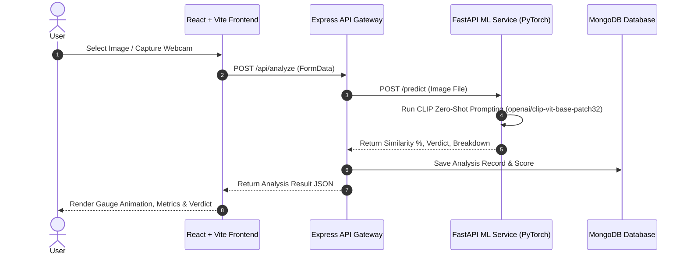

# Ningal Kizhangano 🎯

## Basic Details
### Team Name: Potato

### Team Members
- Team Lead: Pavan Sajeev K K - CUSAT
- Member 2: Swathi T - CUSAT

### Project Description
Everything in this world is either a potato or a lookalike of potato... This website helps you find your or any object's resemblance with a potato using deep learning computer vision!

### The Problem (that doesn't exist)
The problem is to find which object is a potato (which is obvious), but more importantly, mathematically determine *how much* an object resembles a potato down to the starch percentage and earthiness factor.

### The Solution (that nobody asked for)
We calculate the resemblance percentage using OpenAI's CLIP zero-shot neural network model, displaying hilarious spud verdicts, detailed starch metrics, and keeping a global potato leaderboard gallery!

---

## Technical Details

### Technologies/Components Used

#### For Software:
- **Frontend:** React.js, Vite, Tailwind CSS, Lucide Icons, HTML5 Canvas / MediaDevices API (Webcam)
- **Backend API Gateway:** Node.js, Express.js, Multer (Image handling), Mongoose
- **Database:** MongoDB (with resilient in-memory store fallback)
- **Machine Learning Engine:** Python 3.9+, FastAPI, PyTorch, Hugging Face Transformers (`openai/clip-vit-base-patch32`), Pillow (PIL)
- **API Communication:** Axios
- **Deployment:** Render / Hugging Face Spaces / Vercel

---

### Implementation

The project is implemented using a decoupled architecture consisting of a React frontend, Node.js Express API gateway, MongoDB database, and a FastAPI Machine Learning engine powered by Hugging Face CLIP.

#### System Architecture Workflow



---

# Installation & Setup Commands

### Prerequisites
- **Node.js**: v18+ and `npm`
- **Python**: 3.9+ and `pip`
- **MongoDB**: (Optional) Running locally on `mongodb://localhost:27017`

---

### Step 1: Start Python ML Service (FastAPI + PyTorch CLIP)

```bash
cd ml-service
pip install -r requirements.txt
python main.py
```
*The ML Service will launch on `http://localhost:8000`.*

---

### Step 2: Start Node.js Express Backend API Gateway

```bash
cd backend
npm install
npm run dev
```
*The Backend API will launch on `http://localhost:5000`.*

---

### Step 3: Start React Frontend Application

```bash
cd frontend
npm install
npm run dev
```
*Open `http://localhost:3000` in your web browser!*

---

### ⚡ 1-Click Batch Launcher (Windows)

To start all services concurrently with a single command, execute:

```cmd
start-all.bat
```

---

## Project Documentation

### For Software:

#### Screenshots


*Opening Landing Page of **Ningal Kizhangano** introducing the scanner UI, live camera trigger, and sample presets.*

---


*Home Page - Testing potato resemblance in real-time using webcam stream.*

---


*Home Page - Testing using image upload showing Potato-O-Meter score, spud verdict badge, and attribute breakdown (Earthiness, Texture, Starch Index, Roundness).*

---


*Global Spud Leaderboard & History Gallery displaying past scans, similarity ratings, and full inspection modal.*

---

#### Diagrams


*Sequence Diagram showing end-to-end data flow during image analysis.*

---

### For Hardware:
*N/A - This project is entirely software-based.*

---

## Project Demo

### Video
[Watch Project Demo Video]https://drive.google.com/file/d/1ORz3q2Wsl190Hh6mX44_pVkh9Et8O83Y/view?usp=drivesdk
*Demonstrates live webcam scanning, image upload analysis, CLIP neural net inference, real-time score radial gauge animation, attribute breakdown, and leaderboard persistence.*

### Additional Demos
- **Live Local Setup:** Run `start-all.bat` on Windows to test instantly.
- **Pre-loaded Samples:** Test with built-in potato, cat, apple, and fries presets.

---

## Team Contributions

- **Pavan Sajeev K K**: Integrated Hugging Face CLIP (`openai/clip-vit-base-patch32`) zero-shot classification model in Python FastAPI, developed spud similarity scoring algorithms & attribute calculation heuristics (Earthiness, Starch Index, Roundness Factor), built the Node.js / Express API gateway with Multer image upload & MongoDB integration.
- **Swathi T**: Designed and developed the React + Vite frontend UI using Tailwind CSS, implemented real-time webcam video stream capture & file drag-and-drop uploader, created the animated radial score meter, laser sweep scan animation, and the interactive global leaderboard history modal.

---
Made with ❤️ at TinkerHub Useless Projects 


